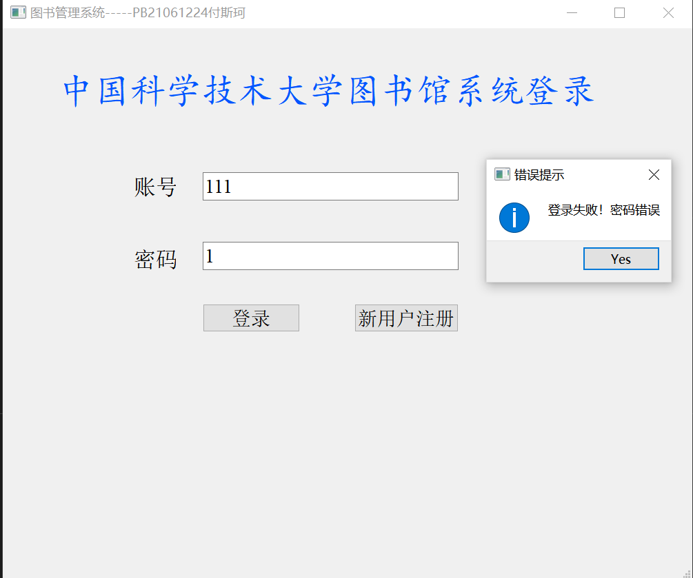
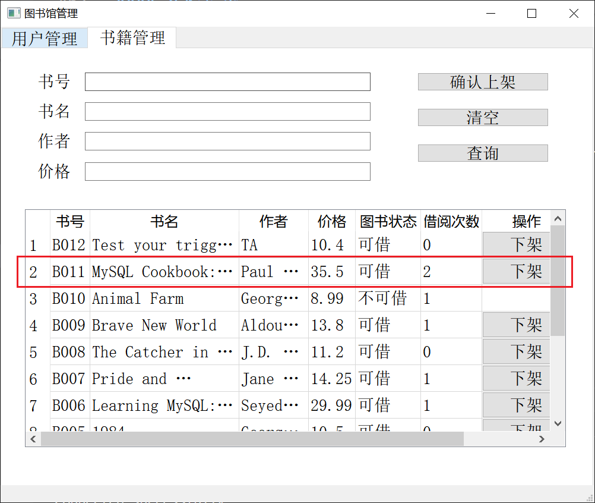

<div style="text-align:center;font-size:2em;font-weight:bold">中国科学技术大学计算机学院</div>

<div style="text-align:center;font-size:2em;font-weight:bold">《数据库系统实验报告》</div>

<p style="text-align: center;"></p>

<div style="display: flex;flex-direction: column;align-items: center;font-size:2em">
<div>
<p>实验题目：图书馆信息管理系统</p>
<p>学生姓名：付斯珂</p>
<p>学生学号：PB21061224</p>
<p>完成时间：2024年6月20日</p>
</div>
</div>

<div style="page-break-after:always"></div>

[toc]

## 需求分析

应用于图书馆管理。
主要功能：

- 用户分为普通用户和管理员
- 用户登录、注册
- 查看、修改个人信息
- 根据图书名关键字查询图书
- 借书、还书
- 查看个人所有的借书历史记录，和未还书记录
- 图书管理员操作：删除用户（自动归还该用户所有的借书），下架和上架书籍

## 总体设计

#### 系统模块结构

> 分为前端和后端两大模块

**前端：** **PyQt5** + **QtDesigner** 开发。QtDesigner设计每个窗口UI界面，导出.ui文件。`pyuic5 -o xxx.py xxx.ui`将.ui文件转化为.py文件。之后在后端import 前端的.py文件。

> 前端文件：

> |  borrow.py
> │  login_start.py
> │  manager.py
> │  personal_information.py
> │  return_book.py
> │  welcome.py
> |  image_rc.py

**后端：** 全部功能实现在 `backend.py`中。对每个窗口，后端绑定功能部件对应功能：执行mySQL数据库操作或者前端操作。

#### 系统工作流程


#### 数据库设计

1. ER图
   
2. 存储过程
   修改读者号。输入参数为旧读者号reader_ID_from和新读者号reader_ID_to。
   需同时更改Reader表和Borrow表。

```sql
DELIMITER //
drop procedure if exists updateReaderID;
create procedure updateReaderID(reader_ID_from varchar(20), reader_ID_to varchar(20))
BEGIN
declare state int default 0;
declare CONTINUE HANDLER for SQLEXCEPTION set state = 1;

-- start transaction;
alter table Borrow
    drop Constraint FK_Borrow_reader;

update Borrow 
set reader_ID = reader_ID_to
where reader_ID = reader_ID_from;

update Reader 
set rid = reader_ID_to
where rid = reader_ID_from;

END //
DELIMITER ;
```

3. 函数
   计算一本书被借阅的总次数。返回值为借阅次数。

```sql
DELIMITER //
drop function if exists getBorrowTimes;
create function getBorrowTimes(rid varchar(20))
returns int
reads sql data
BEGIN
    DECLARE BorrowTimes INT; -- 声明变量
    SELECT count(*) INTO BorrowTimes FROM Borrow WHERE Borrow.reader_ID = rid;
    RETURN BorrowTimes;
END //
DELIMITER ;
```

4. 触发器
   当读者借了一本书，Borrow表中新填一条记录时，触发器将对应被借的书的状态修改为已被借出，借阅次数也加一。

```sql
DELIMITER //
drop trigger if exists borrowBook1;
create trigger borrowBook1 after INSERT on Borrow for each row
BEGIN
    -- 更改Book表中的bstatus
    update Book set bstatus = 0 where bid = new.book_ID;
END //
DELIMITER ;

DELIMITER //
drop trigger if exists borrowBook2;
create trigger borrowBook2 after INSERT on Borrow for each row
BEGIN
   -- 更改Book表中的borrow_Times
    update Book set borrow_Times=borrow_Times+1 where bid = new.book_ID;
END //
DELIMITER ;
```

## 核心代码解析

#### 仓库地址

#### 目录

D:.  
├─report                -------实验报告  
│  │  实验报告.pdf  
│  │  
│  └─image              -------报告中的图片  
│          1.png  
│          10.png  
│          11.png  
│          12.png  
│          13.png  
│          14.png  
│          15.png  
│          16.png  
│          17.png  
│          18.png  
│          19.png  
│          2.png  
│          20.png  
│          21.png  
│          22.png  
│          3.png  
│          4.png  
│          5.png  
│          6.png  
│          7.png  
│          8.png  
│          9.png  
│          ER.png  
│          logo.png  
│  
└─src  
    │  backend.py               -------后端实现  
    │  borrow.py                -------前端：借书窗口  
    │  image_rc.py              -------前端：图片资源  
    │  login_start.py           -------前端：登录窗口  
    │  manager.py               -------前端：管理员操作窗口  
    │  personal_information.py  -------前端：个人信息窗口  
    │  return_book.py           -------前端：还书窗口  
    │  welcome.py               -------前端：导航窗口  
    │  
    ├─MySQL                     -------数据库文件  
    │      create_table.sql     -------建表  
    │      procedure1.sql       -------存储过程  
    │      procedure2.sql       -------函数  
    │      test_cases.sql       -------插入测试用例  
    │      trigger1.sql         -------触发器  
    │  
    ├─ui                        -------前端设计ui文件，用于转换为python文件 
    │      BasicInformation.ui  
    │      borrow.ui  
    │      image.qrc
    │      login.ui  
    │      manager.ui  
    │      personal_information.ui  
    │      return.ui  
    │      temp.ui  
    │      Welcome.ui  
    │  
    ├─user_pics               -------用户头像  
    │      111.jpg  
    │      default.jpg        -------默认头像  
    │      R001.jpg  
    │      R002.jpg  
    │      R003.jpg  
    │      R004.jpg  
    │      R005.jpg  
    │      R006.jpg  
    │  
    └─__pycache__            -------python编译后的文件  
            borrow.cpython-312.pyc  
            image_rc.cpython-312.pyc  
            login.cpython-312.pyc  
            login_start.cpython-312.pyc  
            manager.cpython-312.pyc  
            personal_information.cpython-312.pyc  
            return_book.cpython-312.pyc  
            Welcome.cpython-312.pyc  

#### sql

`create_table.sql`建表。

```sql
use library;
drop table if exists Borrow;
drop table if exists Book;
create table Book(
bid char(8) Primary Key,
bname varchar(100) NOT NULL, 
author varchar(50), 
price float, 
bstatus int DEFAULT 1, -- 1可借 0借出
);

drop table if exists Reader;
create table Reader(
rid varchar(20), 
rpassword varchar(20),
rname varchar(20), 
age int DEFAULT NULL, 
address varchar(100) DEFAULT NULL,
Constraint PK_Reader Primary Key(rid)
);

drop table if exists Manager;
create table Manager(
mid char(20), 
mpassword varchar(20),
mname varchar(20), 
age int, 
address varchar(100),
Constraint PK_Reader Primary Key(mid)
);

create table Borrow( -- 借书信息
book_ID char(8), 
reader_ID char(20), 
borrow_Date date, 
return_Date date DEFAULT NULL,
Constraint PK_Borrow Primary Key(book_ID, reader_ID, borrow_Date),
Constraint FK_Borrow_Book Foreign Key(book_ID) References Book(bid) on delete cascade,
Constraint FK_Borrow_reader Foreign Key(reader_ID) References Reader(rid) on delete cascade
);
```

#### front-end

QtDesigner设计好界面后一系列操作自动生成，已经在“总体设计-系统模块设计-前端”中讲解。

#### back-end

`backend.py`实现
一个类 `class`对应一个窗口。每个类都有类似的方法，如 `execute`事务游标执行sql语句，`error_input`弹出错误提示框，`bind_up`绑定信号和槽函数。但根据每个窗口负责的不同功能，方法有所不同。

##### 连接数据库

`MySQLdb.connect`连接数据库。`status`为0表示连接成功，为1表示连接失败。
实例化所有窗口类。显示login窗口。

```python
if __name__ == "__main__":
	global db
	try:
		db = MySQLdb.connect(host='127.0.0.1', port=3306, user='root', passwd='Fsk20030422',db="library", charset='utf8')
		print("Connected successfully!")
		status = 0
	except:
		status = 1
		print("Failed to connect the database!")

	app = QtWidgets.QApplication(sys.argv)

	LoginWindow = LoginWindow()
	TestWindow = TestWindow()
	PersonnalInformationWindow = PersonnalInformationWindow()
	BorrowWindow = BorrowWindow()
	ReturnWindow = ReturnWindow()
	ManagerWindow = ManagerWindow()

	welcome_window = WelcomeWindow(TestWindow, PersonnalInformationWindow, BorrowWindow, ReturnWindow, ManagerWindow)
	LoginWindow.welcome_window = welcome_window
	LoginWindow.show()

	sys.exit(app.exec_())
```

##### 登录窗口

运行程序，首先出现的是登录窗口。用户可以输入账号和密码登录，也可以点击注册按钮进行注册。登录成功后，根据用户身份显示不同的导航窗口。
初始化 `class LoginWindow` ，`self.bind_up()`绑定信号和槽函数。当登录按钮被点击时，调用 `sign_in`函数。当注册按钮被点击时，调用 `sign_up`函数。

`sign_in`根据lineEdit中的账号和密码查询Reader表，如果查询结果为空，说明账号不存在：分为账号错误和密码错误两种情况。登录成功的同时 `check_manager`检查用户是否在manager表中，若是则接下来的导航窗口显示管理员操作按钮，否则不显示。`sign_up`首先查询注册账号是否已存在，若存在则注册失败，否则插入Reader表。

`execute`方法建立游标执行sql语句，并返回查询结果或执行是否成功。`error_input`方法弹出错误提示框。

登录或注册成功之后，`self.close()`关闭登录窗口，`self.welcome_window.show()`显示导航窗口。

```python
class LoginWindow(QMainWindow, Ui_loginWindow):
	def __init__(self):
		super().__init__() #初始化QMainWindows类
		self.welcome_window = None
		self.setupUi(self)
		self.setWindowTitle('图书管理系统-----PB21061224付斯珂')
		self.bind_up()

	def bind_up(self):
		self.sign_in_button.clicked.connect(self.sign_in)
		self.sign_up_button.clicked.connect(self.sign_up)

	def execute(self, recieve):
		global db
		result = []
		if status == 0:
			cursor = db.cursor()
			try:
				cursor.execute(self.query)
			except:
				self.error_input('SQL执行失败')
				db.rollback()
				return False
			if recieve:  # 有查询结果返回值
				result = cursor.fetchall()
			else: # 无查询结果返回值
				result = cursor.fetchall()
				if(len(result) == 0): 
					result = False
				else: result = True

			db.commit()
			cursor.close()

		self.last = '' #每进行一次操作需要刷新 doubleclicked item时记录的待更改值
		return result

	def error_input(self, err_msg):
		QMessageBox.information(self, "错误提示", err_msg, QMessageBox.Yes)

	# 注册
	def sign_up(self):
		if self.lineEdit.text() == '' or self.lineEdit_2.text() == '':
			self.error_input('输入信息不足!')
			return
		self.query = f"select * from reader where rid={self.lineEdit.text()};"
		exist_id = self.execute(False)
		if exist_id: 
			self.error_input('账号已存在!')
			return
		#确认插入reader
		reply = QMessageBox.question(self, '确认', "确定注册?", QMessageBox.Yes | QMessageBox.No, QMessageBox.No)
		if reply == QMessageBox.No:
			return
		self.query = 'insert into Reader(rid, rpassword) Values(\'{}\', \'{}\');'.format(self.lineEdit.text(), self.lineEdit_2.text())
		self.execute(False)
		global current_user 
		current_user = ((self.lineEdit.text(), None),)
		QMessageBox.information(self, "提示", "注册成功！", QMessageBox.Yes)
		self.welcome_window.pushButton_4.hide()

		self.close()
		self.welcome_window.setWindowTitle("Welcome! ")
		self.welcome_window.show()

	# 登录
	def sign_in(self):
		if self.lineEdit.text() == '' or self.lineEdit_2.text() == '':
			self.error_input('输入信息不足!')
			return
		self.query = 'select rid, rname from Reader where rid=\'{}\' and rpassword=\'{}\';'.format(self.lineEdit.text(), self.lineEdit_2.text())
		global current_user
		current_user = self.execute(True)
		if len(current_user) == 0: 
			self.query = 'select * from Reader where rid=\'{}\';'.format(self.lineEdit.text())
			rid_exist = self.execute(False)
			if rid_exist == False: 
				self.error_input("登录失败！账号不存在")
			else:
				self.error_input("登录失败！密码错误")
		else: 
			print("登录成功！")
			print(current_user)
			current_user_rname = current_user[0][1]

			# 登录成功后检查是否为管理员
			self.check_manager()  # 决定管理员操作button是否显示
			# 关闭登录窗口
			self.close()
			# 根据登录用户名显示导航（欢迎）窗口
			self.welcome_window.setWindowTitle("Welcome! " + str(current_user_rname))
			self.welcome_window.show()


	def check_manager(self):
		global current_user
		rid = current_user[0][0]
		self.query = f"select * from Manager where mid='{rid}';"
		is_manager = self.execute(False)
		if is_manager:
			self.welcome_window.pushButton_4.show()
		else:
			self.welcome_window.pushButton_4.hide()
```

##### 导航窗口

`class WelcomeWindow`显示四个按钮，分别跳转到四个窗口：个人信息窗口、借书窗口、还书窗口、管理员操作窗口。其他内容和其他窗口类似。

```python
def bind_up(self):
    self.pushButton_1.clicked.connect(lambda: self.PersonalnformationWindow.show())
    self.pushButton_2.clicked.connect(lambda: self.BorrowWindow.show())
    self.pushButton_3.clicked.connect(lambda: self.ReturnWindow.show())
    self.pushButton_4.clicked.connect(lambda: self.ManagerWindow.show())
```

##### 个人信息窗口

`class PersonalInformationWindow`显示读者的个人信息，包括读者号、姓名、年龄、地址、头像。用户可以修改信息。

```python
def bind_up(self):
		# 当输入框中的数据改变，则修改数据库对应条目
		self.lineEdit.textChanged.connect(self.change_age)
		self.lineEdit_2.textChanged.connect(self.change_address)
		self.lineEdit_3.textChanged.connect(self.change_name)
		self.lineEdit_4.textChanged.connect(self.change_rid)
		self.pushButton.clicked.connect(self.change_img)

def change_rid(self):
    global current_user
    reader_ID_from = current_user[0][0]
    reader_ID_to = self.lineEdit_4.text()
    # 存储过程
    self.query = f"call updateReaderID('{reader_ID_from}', '{reader_ID_to}');"
    self.execute(False)
    # 修改头像文件名
    if(os.path.exists(f"D:/codeConfiguration/MySQL/lab2/src/user_pics/{reader_ID_to}.jpg") and os.path.exists(f"D:/codeConfiguration/MySQL/lab2/src/user_pics/{reader_ID_from}.jpg")):
        os.rename(f"D:/codeConfiguration/MySQL/lab2/src/user_pics/{reader_ID_from}.jpg", f"D:/codeConfiguration/MySQL/lab2/src/user_pics/{reader_ID_to}.jpg")
    # 更新current_user
    current_user = ((reader_ID_to, current_user[0][1]),)
```

修改QMainWindow的show方法。首先布置好lineEdit的显示内容，插入头像等，最后才是显示。

```python
def show(self):
    global current_user
    current_user_rid = current_user[0][0]
    current_user_rname = current_user[0][1]

    self.query = 'select age from Reader where rid=\'{}\';'.format(current_user_rid)
    current_user_age = self.execute(True)
    current_user_age = current_user_age[0][0]
    self.query = 'select address from Reader where rid=\'{}\';'.format(current_user_rid)
    current_user_address = self.execute(True)
    current_user_address = current_user_address[0][0]

    # 查询数据库中个人信息并显示
    self.lineEdit_4.setText(current_user_rid)
    self.lineEdit_3.setText(str(current_user_rname))
    self.lineEdit.setText(str(current_user_age))
    self.lineEdit_2.setText(str(current_user_address))

    # 头像显示
    img_path = "D:/codeConfiguration/MySQL/lab2/src/user_pics" + "/"+ current_user_rid + ".jpg"
    if(os.path.exists(img_path)):
        self.insert_image(img_path)  # 插入对应用户头像
    else:
        self.insert_image(self.default_img_path)  # 插入默认图片

    super().show()
```

##### 借书和还书窗口

`class BorrowWindow`根据书名关键字，`search_book`查询书籍，点击借书按钮借书（只有可借的书籍会显示借书按钮）。

```python
def search_book(self):
    self.query = f"select * from Book where bname LIKE '%{self.lineEdit.text()}%';"
    book_info = self.execute(True)
    if len(book_info) == 0: 
        self.error_input("未找到相关书籍！")
        return
    self.tableWidget.setRowCount(0)  # 清空表格上次搜索记录
    for row in book_info: 
        i = 0
        bstatus = "可借" if row[4] else "不可借"
        self.tableWidget.insertRow(i)  # 尾部插入一行
        if(row[4] == 0): 
            self.query = f"select borrow_Date from Borrow where book_ID='{row[0]}' and return_Date is NULL;"
            borrow_Date = self.execute(True)
            borrow_Date = borrow_Date[0][0]
            self.tableWidget.setItem(i, 4, QTableWidgetItem(f"{bstatus} 借出日期{str(borrow_Date.year)}-{str(borrow_Date.month)}-{str(borrow_Date.day)}"))
        else: 
            self.tableWidget.setItem(i, 4, QTableWidgetItem(bstatus))
        self.tableWidget.setItem(i, 0, QTableWidgetItem(str(row[0])))  # 设置该行元素
        self.tableWidget.setItem(i, 1, QTableWidgetItem(str(row[1])))
        self.tableWidget.setItem(i, 2, QTableWidgetItem(str(row[2])))
        self.tableWidget.setItem(i, 3, QTableWidgetItem(str(row[3])))
        self.tableWidget.setItem(i, 5, QTableWidgetItem(str(row[5])))
        # 添加借阅按钮
        if(row[4]):
            borrow_buttons = self.__dict__
            borrow_buttons['borrow_button_' + str(i)] = QPushButton('借阅')
            self.tableWidget.setCellWidget(i, 6, borrow_buttons['borrow_button_' + str(i)])  # 假设你想在第8列（索引为7）添加按钮
            borrow_buttons['borrow_button_' + str(i)].clicked.connect(self.borrow_book)
        else :
            self.tableWidget.setItem(i, 6, QTableWidgetItem(''))  # 不可借时不显示按钮
        i += 1
```

`class ReturnWindow`还书窗口，和借书窗口类似。首先查询用户所有借书记录，未还的记录会显示还书按钮，点击还书按钮还书。

##### 管理员操作窗口

`class ManagerWindow`管理员操作窗口，用户管理和书籍管理分别在两个tab窗口中，管理员可以删除用户（自动归还该用户未还的所有书），下架（状态为未被借的）书籍，上架书籍。

## 实验与测试

#### 依赖

> 所需的库、运行环境

- python3
- PyQt5
- MySQLdb

#### 部署

> 代码运行步骤，建议使用命令行运行代码

使用命令行运行代码 `python src/backend.py`

#### 实验结果

登录

登录失败


登陆成功，显示欢迎（导航）界面

个人信息界面

修改个人信息，如修改年龄


借书界面


当前用户借阅Mysql Cookbook

借书成功


还书界面
所有记录


未还记录

归还pride and prejudice

未还记录减少

所有记录中pride and prejudice已被归还，还书日期为今天


以管理员'付斯珂'登录，管理员操作界面

用户管理


删除用户'Cloud'，自动归还该用户所有未还书籍


之前被'Cloud'借出的mysql cookbook状态变为可借



书籍管理

上架新书

查询发现上架成功


## 参考

> 如前端使用的模板、引用的图片来源、第三方库的官网等等

- PyQt5官方文档：https://doc.qt.io/qtforpython/
- qt designer：https://doc.qt.io/qt-5/qtdesigner-manual.html
